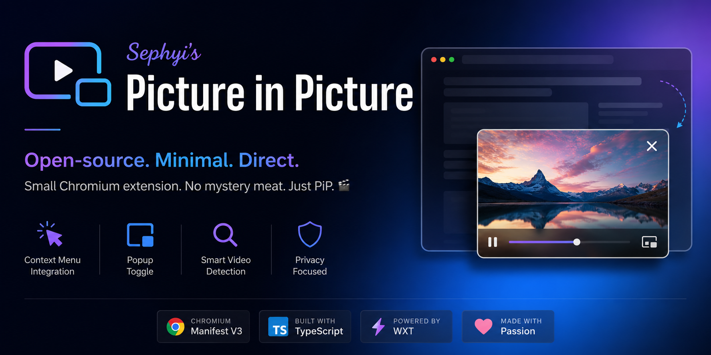

<p align="center">
  
</p>

---

Most Picture-in-Picture extensions are either closed-source, bloated, or surprisingly complicated for something the browser already knows how to do.

At its core, Picture-in-Picture is basically:

```ts
const video = document.querySelector('video');
await video?.requestPictureInPicture();
```

That's the entire joke.

This project simply turns that built-in browser capability into a lightweight Chromium extension you can inspect, trust, and use.

## ✨ Features

- Add a **Picture in Picture** option to the page context menu
- Toggle PiP from the extension popup
- Automatically detect the most relevant video on the page
- Works across most websites exposing a standard HTML video element
- Open-source and fully inspectable

## 🧪 Tested Platforms

| Platform | Status |
| --- | --- |
| Crunchyroll | ✅ |
| Prime Video | ✅ |
| Netflix | ✅ |
| YouTube | ✅ |

> These are simply the platforms I tested personally using Brave on macOS. The extension should work on most websites exposing a standard HTML video element.

## 🤔 Why?

If all you want is PiP for a video you're already watching, you shouldn't need to install a black-box extension and hope for the best.

This project takes the opposite approach:

- Open source
- Small and auditable
- No accounts
- No tracking
- No subscriptions
- No fake productivity features
- Just Picture-in-Picture

## 🚀 Usage

Open a page containing a video, then either:

### Context Menu

Right-click anywhere on the page and select:

```text
Picture in Picture
```

### Extension Popup

Open the extension popup and click:

```text
Toggle PiP on Active Tab
```

## 🔨 Build

> Examples use Bun, but any supported package manager should work.

Install dependencies:

```bash
bun install
```

Create a production build:

```bash
bun run build
```

## 📦 Load in Chromium

1. Build the extension.
2. Open `chrome://extensions`.
3. Enable **Developer mode**.
4. Click **Load unpacked**.
5. Select:

Production build:

```text
.output/chrome-mv3
```

## 💭 Philosophy

This extension is intentionally small.

The goal is not to become a media-control suite, productivity platform, AI assistant, browser operating system, or anything else pretending to be more important than it is.

The goal is to make Picture-in-Picture available quickly, visibly, and without surprises.

If it helps you avoid installing a sketchy extension, it has already done its job.
